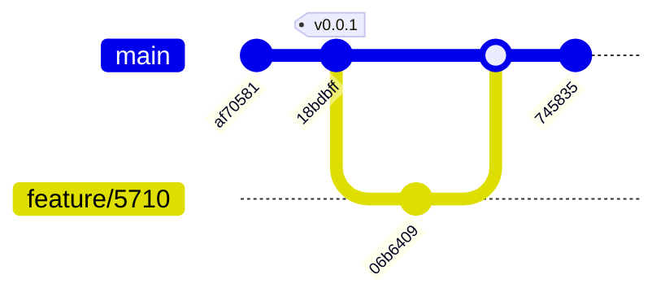

# Yet Another Git Tutorial

[Git](https://git-scm.com/) is a source control management system.
It is an incredible helpful tool to maintain text based files for those who know how to use it well.

## Why Git?

* Industry Standard for SCM
* Well suited to allow review and approval processes
* Auditable
* CI/CD integration
* Huge ecosystem

## Theory

Git does not store files.
Git stores diffs (changes to files) - called **commit**.
A commit consists of:
* The diff to the file(s)
* Author
* Timestamp
* A title and description
* **Commit ID**

```diff
commit 06b6409ab8822756328acefca0eb9ad55358cfc6 (HEAD -> feature/5710, origin/feature/5710)
Author: Sebastian Poehn <seb.poehn@somemail.com>
Date:   Tue Feb 28 14:19:32 2023 +0100

    Mention branches and tags

diff --git a/README.md b/README.md
index e42e489..3f41420 100644
--- a/README.md
+++ b/README.md
@@ -29,7 +29,7 @@ TBD
 The **Commit ID** is a checksum built from the diff and the previous Commit ID.
 All diffs make up the **Git History**.

-
+**Branches** and **tags** are just pointer referencing a commit.

 ```mermaid
 gitGraph
```

The **Commit ID** is a checksum built from the diff and the previous Commit ID.
All diffs make up the **Git History**.

**Branches** and **tags** are just pointer referencing a commit.



## A typical git flow

Download a copy of a remote repository:
```bash
git clone <CLONE_URL>
```

Create a new branch:
```bash
git checkout -B branch_name
```

Do whatever changes are to be done.

Commit the changes:
```bash
git commit
```

Upload the changes to the remote repository:
```bash
git push
```

Create a pull request.
> This is usually done on the remote repository side.

Merge the pull request.

## Tools

* Commandline
* Standalone Git Clients
* IDE-Integrations

## Branching 101

A branching strategy should be as simple as possible and as complex as necessary.
* [Trunk Based Development](https://trunkbaseddevelopment.com/#one-line-summary)
* [Gitflow](https://www.atlassian.com/git/tutorials/comparing-workflows/gitflow-workflow)

## Pitfalls 101
* Bad file layout
If your code base has some central files that basically need a modification in every commit.
This will lead to collisions (called conflicts in git) and require manual resolution all the times.
You should consider using concepts like modules.
Make sure multiple people working on different features at the same time do not have to touch the same files.

* History Rewrites
The history of a repository is a perfectly auditable and searchable timeline of all the work that was ever done.
Don't ever do any history rewrites.
Does not apply for local or remote feature branches that nobody else has pulled.

* Long-living branches
Chunk changes in smaller pieces and merge regularly.
Feature flags or conditionals might be helpful.
With this strategy the code base will diverge less and you have less risk for conflicts.